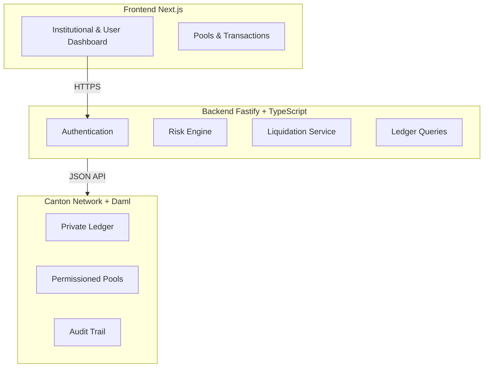

# Cantara Finance

Cantara Finance is a next-generation hybrid lending and borrowing protocol built on the **Canton Network**. It combines the privacy and security of a private ledger with the transparency and accessibility of a modern DeFi application.

## Key Features

-   **Hybrid Architecture**: Seamlessly bridges a Web2-style frontend with a Web3 private ledger backend.
-   **Privacy-First Ledger**: Utilizes **Daml** and **Canton** to ensure that transaction details are visible *only* to the involved parties (e.g., the user and the bank), maintaining strict data confidentiality.
-   **Multi-Asset Lending Pools**: Support for USDC, BTC, ETH, and Canton Coin (CC) with distinct risk parameters.
-   **Real-Time Oracle Integration**: Live price feeds powered by an automated Oracle bot.
-   **Institutional Grade**: Designed to meet the compliance and privacy needs of institutional finance while offering a retail-friendly user experience.

## Institution vs User Experience

Cantara offers tailored experiences for different user types:

| Feature | User | Institution |
| :--- | :---: | :---: |
| **Dashboard** | ✅ | ✅ |
| **Lending/Borrowing** | ✅ | ✅ |
| **Permissioned RWA Pools** | ❌ | ✅ |
| **Private Mode** | ❌ | ✅ |
| **Regulator Disclosure** | ❌ | ✅ |
| **Multi-Party Settlement & Audit Trail** | ❌ | ✅ |

## Privacy & Private Ledger

Cantara Finance leverages the unique capabilities of the **Canton Network** to offer a level of privacy not possible on public blockchains.

-   **Sub-Transaction Privacy**: Unlike public chains where every transaction is visible to everyone, Canton ensures that data is shared **only on a need-to-know basis**.
-   **Private Ledger**: Your financial data (positions, balances, history) resides on a private ledger. Even the network operators cannot see the contents of your smart contracts.
-   **Regulatory Compliance**: The architecture allows for compliant DeFi applications where identity and transaction history can be protected while still proving correctness and validity to regulators or auditors if needed.
-   **Granular Permissions**: Smart contracts (Daml) define precise rules on who can see and act on data, enforcing privacy at the protocol level.

## Security & Risk Management

Cantara Finance employs robust security measures to protect protocol solvency and user funds:

-   **Over-Collateralized Lending**: All loans must be backed by collateral exceeding the value of the debt.
-   **Automated Liquidations**: If a position's health factor drops below 1.0, it is automatically flagged for liquidation to ensure the pool remains solvent.
-   **Risk Parameters**: Each asset has specific risk configurations:
    -   **LTV (Loan-to-Value)**: Maximum borrowing power against collateral.
    -   **Liquidation Threshold**: The point at which a position becomes under-collateralized.
    -   **Liquidation Bonus**: Incentives for liquidators to secure the protocol.
-   **Smart Contract Security**: Built with **Daml**, a language designed for financial correctness, ensuring that assets cannot be created out of thin air and rights are strictly enforced.

## Mathematical Protocols

The core financial logic driving the protocol:

### 1. Health Factor (HF)

The Health Factor represents the safety of your position. If $HF < 1.0$, you are at risk of liquidation.

$$
HF = \frac{\sum (Collateral_i \times Price_i \times LiquidationThreshold_i)}{\sum (Debt_j \times Price_j)}
$$

### 2. Loan-to-Value (LTV)

Determines the maximum amount you can borrow.

$$
MaxBorrow = \sum (Collateral_i \times Price_i \times LTV_i)
$$

### 3. Liquidation Condition

A position is liquidatable when the total value of debt exceeds the risk-adjusted collateral value:

$$
TotalDebt > \sum (Collateral_i \times Price_i \times LiquidationThreshold_i)
$$

## Tech Stack

-   **Frontend**: Next.js 15, React 19, TailwindCSS, Material UI
-   **Backend**: Node.js, Fastify, TypeScript
-   **Smart Contracts**: Daml (Digital Asset Modeling Language)
-   **Ledger**: Canton Network (Sandbox for local dev)
-   **Build System**: TurboRepo

## Getting Started

### Prerequisites

-   **Node.js**: v18+
-   **Java**: JDK 11+ (for Daml Sandbox)
-   **Daml SDK**: [Install Guide](https://docs.daml.com/getting-started/installation.html)
-   **Unix-based OS**: macOS or Linux (WSL for Windows)

### Installation

1.  Clone the repository:
    ```bash
    git clone <repo-url>
    cd CantaraFinance
    ```

2.  Install dependencies:
    ```bash
    npm install
    # or
    yarn install
    ```

### One-Command Startup ⚡️

The easiest way to start the entire stack is using the sequential startup script. This handles everything: building contracts, generating types, and starting all services in the correct order.

```bash
./start_sequential.sh
```

This will start:
-   **Daml Sandbox** (Port 5011)
-   **JSON API** (Port 7575)
-   **Backend API** (Port 4000)
-   **Oracle Bot** (Background process)
-   **Frontend App** (Port 3000)
-   **Navigator** (Port 7500)

Access the application at **[http://localhost:3000](http://localhost:3000)**.

## 🏗 Architecture

The project is organized as a monorepo:



-   `apps/`
    -   `frontend`: The user-facing Next.js application.
    -   `backend`: The API layer that communicates with the Daml ledger.
    -   `oracle-bot`: A service that fetches prices and updates the ledger.
-   `packages/`
    -   `daml-model`: The source of truth. Contains all Daml smart contracts.
    -   `sdk`: Auto-generated TypeScript SDK for interacting with the ledger.
    -   `types`: Shared TypeScript type definitions.

## 💻 Development

If you prefer to run services individually:

**1. Start the Ledger & JSON API:**
```bash
./start_sequential.sh # (You can stop after the ledger starts if you want)
# OR manually:
cd packages/daml-model && daml sandbox
daml json-api --ledger-host localhost --ledger-port 5011 --http-port 7575
```

**2. Start the Backend:**
```bash
cd apps/backend
npm run dev
```

**3. Start the Frontend:**
```bash
cd apps/frontend
npm run dev
```

## Troubleshooting

-   **Ports in use**: If the script fails saying ports are busy, run:
    ```bash
    pkill -f "daml|canton|node"
    ```
-   **Daml Build Errors**: Ensure you have the correct Java version and Daml SDK installed.
-   **Frontend Data Missing**: Make sure the **Backend** and **JSON API** are running. The frontend depends on them for data.

---

*Built with ❤️ for the Future of Finance.*
